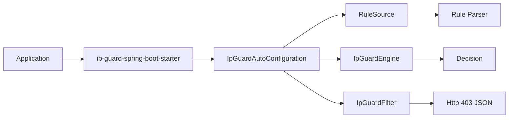

# ip-guard OSS

[](https://github.com/jho951/ip-guard/actions/workflows/build.yml)
[](https://github.com/jho951/ip-guard/actions/workflows/publish.yml)
[](https://central.sonatype.com/search?q=io.github.jho951%20ip-guard)
[](./License)
[](https://github.com/jho951/ip-guard/tags)

이 저장소는 범용 IP 접근 제어를 제공하는 OSS `ip-guard` 레이어입니다.

- 입력된 client IP를 기준으로 allow / deny를 판정합니다.
- 특정 서비스명, 특정 도메인, 특정 배포 구조를 알지 않습니다.
- 재사용 가능한 IP access-control 책임만 가집니다.

현재 릴리스 기준 버전은 `1.0.0`입니다.

## 30초 요약

```gradle
repositories {
    mavenCentral()
}

dependencies {
    implementation("io.github.jho951:ip-guard-spring-boot-starter:1.0.0")
    implementation("io.github.jho951:ip-guard-source-env:1.0.0")
}
```

```java
RuleSource source = () -> "127.0.0.1\n10.10.*.*";
IpGuardEngine engine = new IpGuardEngine(source, false);

Decision decision = engine.decide("10.10.1.2");
boolean allowed = decision.allowed();
String reason = decision.reason();
```



## 목표

- IP 파싱과 규칙 판정을 명확하게 분리
- CIDR, range, wildcard 규칙을 공통 형식으로 처리
- RuleSource SPI로 규칙 소스를 교체 가능하게 유지
- Spring Boot starter와 optional source 모듈로 빠르게 연결 가능하게 제공
- 최소한의 공통 응답 형식을 제공하되 override 가능하게 유지

---

## 프로젝트 구조

```text
├─ spi
├─ core
├─ source-env
├─ source-file
├─ config
├─ docs
└─ README.md
```

---

## 문서

- 개발 가이드: [docs/DEVELOPMENT.md](./docs/DEVELOPMENT.md)
- 현재 상태: [docs/CURRENT_STATUS.md](./docs/CURRENT_STATUS.md)

---

## 모듈

> 이 저장소는 **OSS IP access-control** 레이어입니다.

| Module | 설명 |
| --- | --- |
| `spi` | 규칙 소스 인터페이스 `RuleSource` 를 제공합니다. |
| `core` | IP 파싱, 룰 파싱/매칭, 결정 엔진 `IpGuardEngine` 를 제공합니다. |
| `source-env` | 환경변수 기반 `RuleSource` 구현과 auto-configuration 을 제공합니다. |
| `source-file` | 파일 기반 `RuleSource` 구현과 auto-configuration 을 제공합니다. |
| `config` | Spring Boot AutoConfiguration, `ClientIpResolver`, `BlockResponseWriter`, `IpGuardFilter`를 제공합니다. |
| `docs` | 개발/릴리즈/운영 가이드를 담습니다. |

---

## 시작하기

### 1) Spring Boot에서 사용

```gradle
repositories {
    mavenCentral()
}

dependencies {
    implementation("io.github.jho951:ip-guard-spring-boot-starter:2.0.5")
    implementation("io.github.jho951:ip-guard-source-env:2.0.5")
    implementation("io.github.jho951:ip-guard-source-file:2.0.5")
}
```

```yaml
ipguard:
  default-allow: false
  env:
    env-key: IPGUARD_RULES
  client-ip-strategy: REMOTE_ADDR_ONLY
```

```bash
export IPGUARD_RULES=$'127.0.0.1\n10.0.0.0/8\n192.168.1.10-192.168.1.20\n2001:db8::/32'
```

요청 IP가 룰에 매칭되지 않으면 `403`과 함께 아래 형태의 응답을 반환합니다.

```json
{"message":"ACCESS_DENIED","reason":"NO_MATCH"}
```

기본 차단 응답은 `BlockResponseWriter` Bean을 직접 등록하면 교체할 수 있습니다.

### 2) 코어만 직접 사용

Spring 없이 Java 서비스에서 재사용하려면 `core`와 원하는 `RuleSource` 구현을 직접 조합하면 됩니다.

```gradle
dependencies {
    implementation("io.github.jho951:ip-guard-core:2.0.5")
    implementation("io.github.jho951:ip-guard-source-file:2.0.5")
}
```

```java
RuleSource source = () -> "127.0.0.1\n10.10.*.*";
IpGuardEngine engine = new IpGuardEngine(source, false);

Decision decision = engine.decide("10.10.1.2");
boolean allowed = decision.allowed();
String reason = decision.reason();
```

---

## 규칙 포맷

한 줄에 하나의 규칙을 작성합니다.

- 단일 IP
  - `127.0.0.1`
  - `2001:db8::1`
- CIDR
  - `10.0.0.0/8`
  - `2001:db8::/32`
- 범위
  - `192.168.1.10-192.168.1.20`
- IPv4 wildcard
  - `10.*.*.*` -> `10.0.0.0/8`
  - `192.168.*.*` -> `192.168.0.0/16`

주석/공백 처리:

- 빈 줄은 무시됩니다.
- `#`, `//` 이후는 주석으로 처리됩니다.

주의:

- 와일드카드는 연속되어야 합니다. (`10.*.1.*` 불가)
- `*.*.*.*` 같은 전체 허용 형태는 허용되지 않습니다.
- 범위 시작/끝 IP의 family(IPv4/IPv6)가 다르면 예외가 발생합니다.

---

## 판정 결과

`IpGuardEngine#decide`의 대표 `reason` 값은 다음과 같습니다.

- `MATCHED_RULE`: 규칙 매칭으로 허용
- `NO_MATCH`: 규칙은 있으나 미매칭으로 차단
- `DEFAULT_ALLOW`: 규칙 비어 있고 기본 허용
- `DEFAULT_DENY`: 규칙 비어 있고 기본 차단
- `INVALID_IP`: 입력 IP 파싱 실패로 차단

---

## Spring 필터 동작

`IpGuardFilter`는 `ClientIpResolver`를 통해 client IP를 얻고, `BlockResponseWriter`로 차단 응답을 씁니다.

입력 정규화:

- `[2001:db8::1]:443` 형태의 IPv6 + port 입력을 지원합니다.
- `192.168.0.1:8080` 형태의 IPv4 + port 입력을 지원합니다.
- `fe80::1%en0` 형태의 IPv6 zone suffix는 제거 후 비교합니다.

`ClientIpResolver`는 `REMOTE_ADDR_ONLY`, `XFF_FIRST`, `TRUSTED_PROXY_CHAIN` 전략을 지원합니다.

프록시 환경에서는 `X-Forwarded-For`를 무조건 신뢰하지 말고, trusted proxy 설정과 함께 사용하세요.

응답은 최소한의 공통 형식을 제공합니다. gateway 전용 path 정책, auth 전용 응답 규약, 특정 서비스 전용 코드 체계는 이 모듈의 책임이 아닙니다. `BlockResponseWriter`를 교체하면 platform 계층 응답 규약으로 바꿀 수 있습니다.

---

## 커스텀 RuleSource

기본 `EnvRuleSource` 대신 `RuleSource` Bean을 직접 등록하면 자동 설정이 이를 사용합니다.

```java
@Bean
RuleSource ruleSource() {
    return new FileRuleSource(Path.of("./ip-rules.txt"));
}
```

`source-env` 모듈을 함께 쓰면 환경변수 기반 `RuleSource`가 자동 등록됩니다.

```yaml
ipguard:
  env:
    env-key: IPGUARD_RULES
```

`source-file` 모듈을 함께 쓰면 파일 기반 `RuleSource`를 경로 설정으로 자동 등록할 수 있습니다.

```yaml
ipguard:
  file:
    path: ./ip-rules.txt
```

클라이언트 IP 추출 전략은 다음 중 하나를 고를 수 있습니다.

- `REMOTE_ADDR_ONLY`: `getRemoteAddr()`만 사용
- `XFF_FIRST`: `X-Forwarded-For`의 첫 번째 값 사용
- `TRUSTED_PROXY_CHAIN`: 신뢰된 프록시 목록을 기준으로 체인에서 client IP 계산

`TRUSTED_PROXY_CHAIN`을 사용할 때는 신뢰할 프록시 목록도 함께 둡니다.

```yaml
ipguard:
  client-ip-strategy: TRUSTED_PROXY_CHAIN
  trusted-proxies: |
    10.0.0.0/8
    192.168.0.0/16
```

`ClientIpResolver` Bean을 직접 등록하면 IP 추출 전략도 교체할 수 있습니다.

---

## 책임 경계

이 모듈은 아래를 하지 않습니다.

- gateway 전용 path 규칙 하드코딩
- `/admin/**`, `/internal/**` 같은 기본 경로 정책 강제
- auth-server 같은 특정 서비스와 직접 결합
- 특정 도메인 모델에 대한 의존
- 특정 Redis 키 설계 강제
- 특정 배포 구조 강제

---

## 빌드 & 테스트

```bash
./gradlew clean build
./gradlew test
```

---

## License

> [MIT License](./License)
